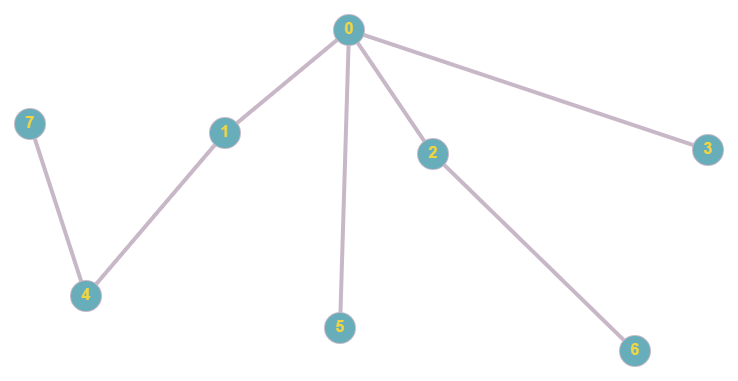
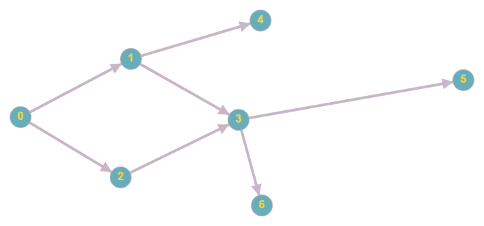
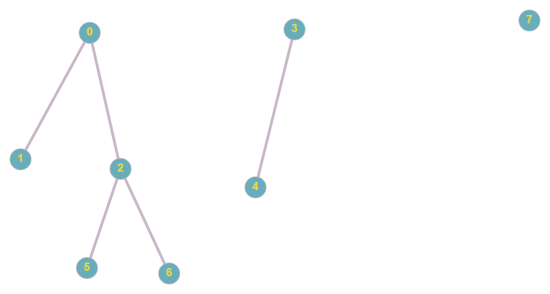

Java Community Dnepr
========

This is the project where you can train you algorithmic skills in:

- Pre-requirements and terms (example with minimum in arrays) 
    - Invariant
    - Deterministic answer 
    - Relaxation of answer
    - Optimal answer constructive
    - Dynamic programming 
    - Correctness
    - Marker that solution is not exists
    - Tail recursion over iteration 
     
- Build your own graph using Java SDK
    - From edge list to adjacency lists; 

- bfs (Breadth first search)
    - Build order of traverse from given vertex;
    - Calculate level of each vertex from given;
    
- dfs (Depth first search)
    - Build order of traverse from given vertex; Make tabulation
    - Topological sorting; (Example in constructor injection in Spring, tabulation)
    - Calculate deep of each vertex from given;

- backtracking with dfs
    - Build all possible passes from src to dest;

- djus (Disjoint Set Union or Union Find)
    - Build bridge between two vertexes;
    - Check if to vertexes are on one and the same component;
    - Amount of components;
    - Path compression optimization
    - Ranks optimization

Test cases are created for:
-  
- 
- 
- 
- 
- 
- 
- 
- 

Check out and code branch: `master`

Pictures was build with [this tool](https://graphonline.ru/)

If there is some time left: 
- Cheney's algorithm;
- Test if a graph is bipartite;
- Make correctness checker for dfs, bfs, top sort;

Recommended exercises:
General approach how to deserialize and serialize data-structure from file and to file;
https://leetcode.com/problems/serialize-and-deserialize-binary-tree/

Iterative and recursive BFS:
https://www.techiedelight.com/breadth-first-search/

Topological sorting:
https://www.geeksforgeeks.org/topological-sorting/
https://www.youtube.com/watch?v=IjLHY5U4y2c&list=PLDrmKwRSNx7KcHxyf9hSmF3fTLKSwujkM&index=5

Arbitrage search
https://www.geeksforgeeks.org/detect-negative-cycle-graph-bellman-ford/
https://medium.com/@anilpai/currency-arbitrage-using-bellman-ford-algorithm-8938dcea56ea

dsu
http://e-maxx.ru/algo/dsu
https://cp-algorithms.com/data_structures/disjoint_set_union.html